# Self-Driving Car Engineer Nanodegree

## Deep Learning

## Project: Build a Traffic Sign Recognition Classifier

In this notebook, a template is provided for you to implement your functionality in stages, which is required to successfully complete this project. If additional code is required that cannot be included in the notebook, be sure that the Python code is successfully imported and included in your submission if necessary. 

> **Note**: Once you have completed all of the code implementations, you need to finalize your work by exporting the iPython Notebook as an HTML document. Before exporting the notebook to html, all of the code cells need to have been run so that reviewers can see the final implementation and output. You can then export the notebook by using the menu above and navigating to  \n",
    "**File -> Download as -> HTML (.html)**. Include the finished document along with this notebook as your submission. 

In addition to implementing code, there is a writeup to complete. The writeup should be completed in a separate file, which can be either a markdown file or a pdf document. There is a [write up template](https://github.com/udacity/CarND-Traffic-Sign-Classifier-Project/blob/master/writeup_template.md) that can be used to guide the writing process. Completing the code template and writeup template will cover all of the [rubric points](https://review.udacity.com/#!/rubrics/481/view) for this project.

The [rubric](https://review.udacity.com/#!/rubrics/481/view) contains "Stand Out Suggestions" for enhancing the project beyond the minimum requirements. The stand out suggestions are optional. If you decide to pursue the "stand out suggestions", you can include the code in this Ipython notebook and also discuss the results in the writeup file.


>**Note:** Code and Markdown cells can be executed using the **Shift + Enter** keyboard shortcut. In addition, Markdown cells can be edited by typically double-clicking the cell to enter edit mode.

---
The goals / steps of this project are the following:
* Load the data set (see below for links to the project data set)
* Explore, summarize and visualize the data set
* Design, train and test a model architecture
* Use the model to make predictions on new images
* Analyze the softmax probabilities of the new images
* Summarize the results with a written report

## Step 0: Load The Data

### Import all necessary modules


```python
import numpy as np
import matplotlib.pyplot as plt
import random
import cv2
from sklearn.utils import shuffle
import csv
import os
import tensorflow as tf
from tensorflow.contrib.layers import flatten
from sklearn.metrics import confusion_matrix
import pickle
%matplotlib inline
```


```python
# Load pickled data
# TODO: Fill this in based on where you saved the training and testing data
training_file = "../data/train.p"
validation_file = "../data/valid.p"
testing_file = "../data/test.p"

with open(training_file, mode='rb') as f:
    train = pickle.load(f)
with open(validation_file, mode='rb') as f:
    valid = pickle.load(f)
with open(testing_file, mode='rb') as f:
    test = pickle.load(f)
    
X_train, y_train = train['features'], train['labels']
X_valid, y_valid = valid['features'], valid['labels']
X_test, y_test = test['features'], test['labels']
```


```python
# Map classID to traffic sign names.
signs = []
with open('signnames.csv', 'r') as csvfile:
    signnames = csv.reader(csvfile, delimiter=',')
    next(signnames,None)
    for row in signnames:
        signs.append(row[1])
    csvfile.close()
```

---

## Step 1: Dataset Summary & Exploration

The pickled data is a dictionary with 4 key/value pairs:

- `'features'` is a 4D array containing raw pixel data of the traffic sign images, (num examples, width, height, channels).
- `'labels'` is a 1D array containing the label/class id of the traffic sign. The file `signnames.csv` contains id -> name mappings for each id.
- `'sizes'` is a list containing tuples, (width, height) representing the original width and height the image.
- `'coords'` is a list containing tuples, (x1, y1, x2, y2) representing coordinates of a bounding box around the sign in the image. **THESE COORDINATES ASSUME THE ORIGINAL IMAGE. THE PICKLED DATA CONTAINS RESIZED VERSIONS (32 by 32) OF THESE IMAGES**

Complete the basic data summary below. Use python, numpy and/or pandas methods to calculate the data summary rather than hard coding the results. For example, the [pandas shape method](http://pandas.pydata.org/pandas-docs/stable/generated/pandas.DataFrame.shape.html) might be useful for calculating some of the summary results. 

### Question 1:1. Provide a basic summary of the data set. In the code, the analysis should be done using python, numpy and/or pandas methods rather than hardcoding results manually.

#### Answer:

### Provide a Basic Summary of the Data Set Using Python, Numpy and/or Pandas


```python
### Replace each question mark with the appropriate value. 
### Use python, pandas or numpy methods rather than hard coding the results

# TODO: Number of training examples
n_train = X_train.shape[0]

# TODO: Number of validation examples
n_validation = X_valid.shape[0]

# TODO: Number of testing examples.
n_test = X_test.shape[0]

# TODO: What's the shape of an traffic sign image?
image_shape = X_train[0].shape

# TODO: How many unique classes/labels there are in the dataset.
n_classes = len(np.unique(y_train))

print("Number of training examples =", n_train)
print("Number of testing examples =", n_test)
print("Image data shape =", image_shape)
print("Number of classes =", n_classes)
```

    Number of training examples = 34799
    Number of testing examples = 12630
    Image data shape = (32, 32, 3)
    Number of classes = 43
    

### Question 1:2. Include an exploratory visualization of the dataset.

#### Answer:

### Include an exploratory visualization of the dataset

Visualize the German Traffic Signs Dataset using the pickled file(s). This is open ended, suggestions include: plotting traffic sign images, plotting the count of each sign, etc. 

The [Matplotlib](http://matplotlib.org/) [examples](http://matplotlib.org/examples/index.html) and [gallery](http://matplotlib.org/gallery.html) pages are a great resource for doing visualizations in Python.

**NOTE:** It's recommended you start with something simple first. If you wish to do more, come back to it after you've completed the rest of the sections. It can be interesting to look at the distribution of classes in the training, validation and test set. Is the distribution the same? Are there more examples of some classes than others?

#### Visualize traffic sign images to understand their perspective and quality


```python
### Data exploration visualization code goes here.
### Feel free to use as many code cells as needed.

def visualize_sign_images(x_data, y_data, ylabel, cmap=None):
    """
    Visualizes few of the traffic sign images with their corresponding label.
    """ 
    plt.figure(figsize=(15, 16))
    for i in range(6):
        plt.subplot(1, 6, i+1)
        indx = random.randint(0, len(x_data))
        # Set cmap = 'gray', color channel dimension doesn't exist
        cmap = 'gray' if len(x_data[indx].shape) < 3 else cmap
        plt.imshow(x_data[indx], cmap = cmap)
        plt.xlabel(signs[y_data[indx]])
        plt.ylabel(ylabel)
    plt.tight_layout(pad=0, h_pad=0, w_pad=0)
    plt.show()
```


```python
# Plotting image samples from X_train, X_test and X_valid
visualize_sign_images(X_train, y_train, "Training sample")
visualize_sign_images(X_test, y_test, "Testing sample")
visualize_sign_images(X_valid, y_valid, "Validation sample")
```


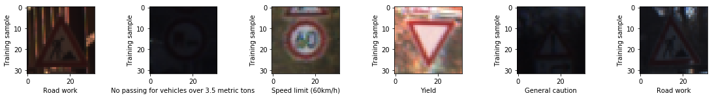


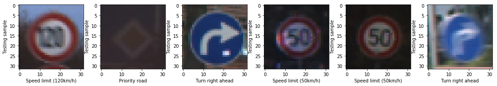


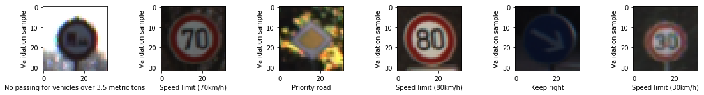


#### Plotting histogram to understand dataset distribution for signs.


```python
def plot_histogram(x_input, xlabel):
    plt.figure(figsize=(15, 6))
    plt.hist(x_input, bins=n_classes, alpha=0.5, histtype='bar', ec='black')
    plt.title(xlabel)
    plt.xlabel("Traffic sign classes")
    plt.ylabel("Image count")
    plt.xticks(range(0, n_classes))
    plt.show()
```


```python
plot_histogram(y_train, "Training set")
plot_histogram(y_test, "Testing set")
plot_histogram(y_valid, "Validation set")
```


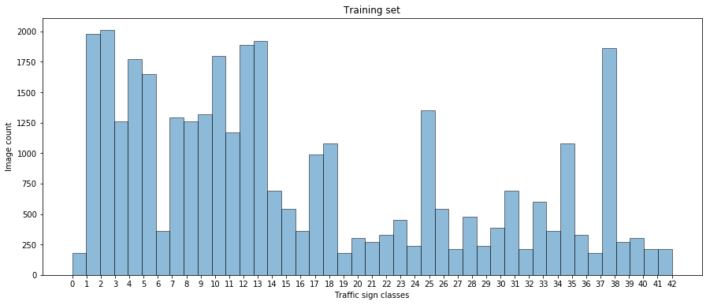


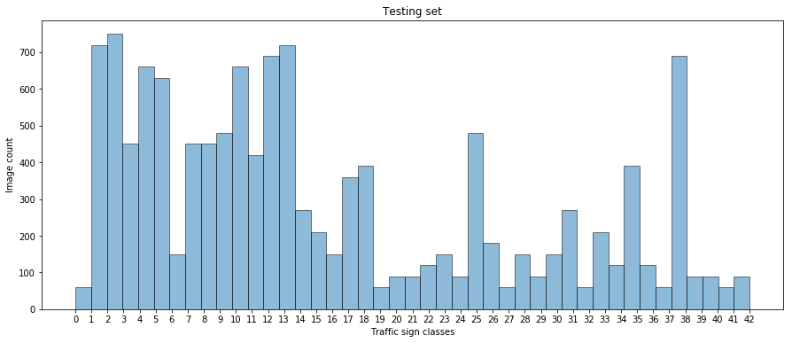


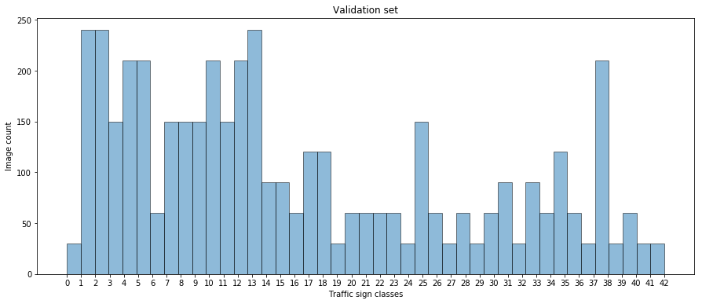


----

## Step 2: Design and Test a Model Architecture

Design and implement a deep learning model that learns to recognize traffic signs. Train and test your model on the [German Traffic Sign Dataset](http://benchmark.ini.rub.de/?section=gtsrb&subsection=dataset).

The LeNet-5 implementation shown in the [classroom](https://classroom.udacity.com/nanodegrees/nd013/parts/fbf77062-5703-404e-b60c-95b78b2f3f9e/modules/6df7ae49-c61c-4bb2-a23e-6527e69209ec/lessons/601ae704-1035-4287-8b11-e2c2716217ad/concepts/d4aca031-508f-4e0b-b493-e7b706120f81) at the end of the CNN lesson is a solid starting point. You'll have to change the number of classes and possibly the preprocessing, but aside from that it's plug and play! 

With the LeNet-5 solution from the lecture, you should expect a validation set accuracy of about 0.89. To meet specifications, the validation set accuracy will need to be at least 0.93. It is possible to get an even higher accuracy, but 0.93 is the minimum for a successful project submission. 

There are various aspects to consider when thinking about this problem:

- Neural network architecture (is the network over or underfitting?)
- Play around preprocessing techniques (normalization, rgb to grayscale, etc)
- Number of examples per label (some have more than others).
- Generate fake data.

Here is an example of a [published baseline model on this problem](http://yann.lecun.com/exdb/publis/pdf/sermanet-ijcnn-11.pdf). It's not required to be familiar with the approach used in the paper but, it's good practice to try to read papers like these.

### Question 2:1. Describe how you preprocessed the image data. What techniques were chosen and why did you choose these techniques? Consider including images showing the output of each preprocessing technique. Pre-processing refers to techniques such as converting to grayscale, normalization, etc. (OPTIONAL: As described in the "Stand Out Suggestions" part of the rubric, if you generated additional data for training, describe why you decided to generate additional data, how you generated the data, and provide example images of the additional data. Then describe the characteristics of the augmented training set like number of images in the set, number of images for each class, etc.)

#### Answer:

### Pre-process the Data Set (normalization, grayscale, etc.)

Minimally, the image data should be normalized so that the data has mean zero and equal variance. For image data, `(pixel - 128)/ 128` is a quick way to approximately normalize the data and can be used in this project. 

Other pre-processing steps are optional. You can try different techniques to see if it improves performance. 

Use the code cell (or multiple code cells, if necessary) to implement the first step of your project.

#### Data Augmentation

For each image in the training data set we will generate/augment upto 8 variations for it using various data augmentation strategies

We have created several data augmentation helper functions

<b>Perspective Warp</b>: This function takes base input image and the type of warping the user expects(from the defined types), it will warp the base image to that perspective.

<b>Rotate Image</b>: This function takes base input image and the angle the user expects the image to rotate, it will rotate the base image to the passed angle.

<b>Gaussian Noise</b>: This function takes base input image, generates a gaussian noise that maps the image dimensions and adds it to image. (Note: Although I thought this function will be helpful for data augmentation which will help build on accuracy, but even without its use the base model is saturating to correct predictions very quickly, I removed this to save on some parameters)

<b>Gamma Correction</b>: This function takes the base input image, builds a lookup table by looping over all pixel values in the range [0, 255]. The pixel value is then scaled to the range [0, 1.0] followed by being raised to the power of the inverse gamma — this value is then stored in the table, next we use cv2.LUT to take the input image  and the table  and find the correct mappings for each pixel value.

<b>Blur</b>: This function takes base input image, generates and applies a gaussian blur the image by using cv2.GaussianBlur().

<b>Perspective Warp</b>


```python
def perspective_warp(img, tilt_type):
    warp_img = img.copy()
    wimg_size = (warp_img.shape[1], warp_img.shape[0])
    
    def get_source_dst_pts(p1, p2, p3, p4):  
        src_pts = np.float32([
            [p1[0], p1[1]],
            [p2[0], p2[1]],
            [p3[0], p3[1]],
            [p4[0], p4[1]]
        ])

        dst_pts = np.float32([
            [0, 0],
            [0, wimg_size[1]],
            [wimg_size[0], wimg_size[1]],
            [wimg_size[0], 0]
        ])
        return (src_pts, dst_pts)
    #Tilt
    tilt_left = get_source_dst_pts((0, 0), (0, wimg_size[1]), (wimg_size[0]*0.9, wimg_size[1]*0.85), (wimg_size[0]*0.9, wimg_size[1]*0.15))
    tilt_right = get_source_dst_pts((wimg_size[0]*0.1, wimg_size[1]*0.15), (wimg_size[0]*0.1, wimg_size[1]*0.85), (wimg_size[0], wimg_size[1]), (wimg_size[0], 0))
    tilt_front = get_source_dst_pts((wimg_size[0]*0.15, wimg_size[1]*0.15), (0, wimg_size[1]), (wimg_size[0], wimg_size[1]), (wimg_size[0]*0.85, wimg_size[1]*0.15))
    tilt_back = get_source_dst_pts((0, 0), (wimg_size[0]*0.15, wimg_size[1]*0.9), (wimg_size[0]*0.85, wimg_size[1]*0.9), (wimg_size[0], 0))
    # Sheer
    sheer_left = get_source_dst_pts((0, 0), (wimg_size[0]*0.15, wimg_size[1]), (wimg_size[0], wimg_size[1]), (wimg_size[0]*0.85, 0))
    sheer_right = get_source_dst_pts((wimg_size[0]*0.15, 0), (0, wimg_size[1]), (wimg_size[0]*0.85, wimg_size[1]), (wimg_size[0], 0))
    # Tilt type to var mapping
    tilt_map = {
        "left": tilt_left,
        "right": tilt_right,
        "front": tilt_front,
        "back": tilt_back,
        "sheer_left": sheer_left,
        "sheer_right": sheer_right
    }
    # get source and destination co-ordinated for passed in tilt_type
    tilt_cords = tilt_map[tilt_type]
    M = cv2.getPerspectiveTransform(tilt_cords[0], tilt_cords[1])
    warped = cv2.warpPerspective(warp_img, M, wimg_size, flags=cv2.INTER_LINEAR)
    return warped
```

<b>Rotate Image</b>


```python
def rotate_image(image, angle):
    rot_img = image.copy()
    image_center = tuple(np.array(rot_img.shape[1::-1]) / 2)
    rot_mat = cv2.getRotationMatrix2D(image_center, angle, 1.1)
    result = cv2.warpAffine(rot_img, rot_mat, rot_img.shape[1::-1], flags=cv2.INTER_LINEAR)
    return result
```

<b>Gaussian Noise</b>


```python
def add_gauss_noise(image):
    noisy_img = image.copy()
    row,col= noisy_img.shape
    mean = 0
    var = 0.1
    sigma = var**0.5
    gauss = np.random.normal(mean,sigma,(row,col))
    gauss = gauss.reshape(row,col)
    noisy = (gauss + noisy_img)
    noisy = cv2.normalize(noisy,None,0,255,cv2.NORM_MINMAX)
    return noisy
```

<b>Gamma Correction</b>


```python
def adjust_gamma(image, gamma=1.0):
    g_img = image.copy()
    invGamma = 1.0 / gamma
    table = np.array([((i / 255.0) ** invGamma) * 255
      for i in np.arange(0, 256)]).astype("uint8")
    return cv2.LUT(g_img, table)
```

<b>Blur</b>


```python
def blur_img(image):
    blurred_img = image.copy()
    return cv2.GaussianBlur(blurred_img,(1, 1), 0)
```

<b>Data Augmentation Pipeline</b>

Augmentation pipleline for single image.


```python
def augment_image(image, label):
    aug_img = image.copy()
    # Define augmentation container for a single image
    aug_x = []
    aug_y = []
    
    # Original Image Type 0
    aug_x.append(aug_img)
    aug_y.append(label)
    
    # Augmented Image Type 1
    aug_img1 = perspective_warp(aug_img, "right")
    aug_img1 = rotate_image(aug_img1, -3)
    aug_img1 = adjust_gamma(aug_img1, gamma=0.5)
    aug_x.append(aug_img1)
    aug_y.append(label)
    
    # Augmented Image Type 2
    aug_img2 = perspective_warp(aug_img, "left")
    aug_img2 = rotate_image(aug_img2, 3)
    aug_img2 = adjust_gamma(aug_img2, gamma=0.5)
    aug_x.append(aug_img2)
    aug_y.append(label)
    
    # Augmented Image Type 3
    aug_img3 = rotate_image(aug_img, -4)
    aug_img3 = adjust_gamma(aug_img3, gamma=0.5)
    aug_x.append(aug_img3)
    aug_y.append(label)
    
    # Augmented Image Type 4
    aug_img4 = rotate_image(aug_img, 4)
    aug_img4 = adjust_gamma(aug_img4, gamma=0.5)
    aug_x.append(aug_img4)
    aug_y.append(label)
    
    # Augmented Image Type 5
    aug_img5 = perspective_warp(aug_img, "left")
    aug_img5 = perspective_warp(aug_img5, "sheer_left")
    aug_img5 = adjust_gamma(aug_img5, gamma=1.5)
    aug_x.append(aug_img5)
    aug_y.append(label)
    
    # Augmented Image Type 6
    aug_img6 = perspective_warp(aug_img, "right")
    aug_img6 = perspective_warp(aug_img6, "sheer_right")
    aug_img6 = adjust_gamma(aug_img6, gamma=1.5)
    aug_x.append(aug_img6)
    aug_y.append(label)
    
    # Augmented Image Type 7
    aug_img7 = adjust_gamma(aug_img, gamma=0.5)
    aug_img7 = blur_img(aug_img7)
    aug_x.append(aug_img7)
    aug_y.append(label)
    
    # Augmented Image Type 8
    aug_img8 = adjust_gamma(aug_img, gamma=1.5)
    aug_img8 = blur_img(aug_img8)
    aug_x.append(aug_img8)
    aug_y.append(label)
    
    # Return both containers
    return aug_x, aug_y
```

Augmentation pipleline for multiple images.


```python
def augment_data(X, Y):
    aug_all_x = []
    aug_all_y = []
    for i in range(len(X)):
        # Augment image at position X[i] and alocate its label as Y[i]
        aug_x, aug_y = augment_image(X[i], Y[i])
        aug_all_x.extend(aug_x)
        aug_all_y.extend(aug_y)
    aug_all_x = np.asarray(aug_all_x)
    aug_all_y = np.asarray(aug_all_y)
    return aug_all_x, aug_all_y
```

#### Grayscaling

In their paper "Traffic Sign Recognition with Multi-Scale Convolutional Networks" published in 2011, P. Sermanet and Y. LeCun stated that using grayscale images instead of color improves the ConvNet's accuracy. We will use OpenCV to convert the training images into gray scale.


```python
def get_grayscale(rgb_image):
    """
    Convert RGB image to grayscale
    """
    return cv2.cvtColor(rgb_image, cv2.COLOR_RGB2GRAY)
```


```python
# Convert RGB input training images to grayscale using our get_grayscale func
grayscale_imgs = list(map(get_grayscale, X_train))
visualize_sign_images(grayscale_imgs, y_train, "Gray Scale image", cmap="gray")
```


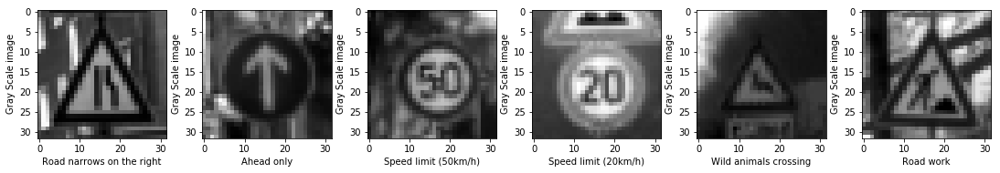


#### Histogram Equalization

Histogram equalization is a technique for adjusting image intensities to enhance contrast. Since from the dataset it is clear and more obvious that(due to fog or low light conditions many images of traffic signs might have low contrast)


```python
def equalize_hist(unequalized_img):
    """
    Apply Histogram Equalization on grayscaled images
    """
    eq_img = unequalized_img.copy() 
    eq_img = cv2.equalizeHist(eq_img)
    return eq_img
```


```python
# Perform histogram equalization on the training images.
equalized_imgs = list(map(equalize_hist, grayscale_imgs))
visualize_sign_images(equalized_imgs, y_train, "Equalized Image", cmap="gray")
```


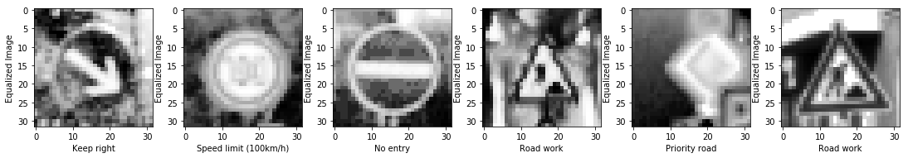


#### Normalization

Normalization is a process that changes the range of pixel intensity values. Usually the image data should be normalized so that the data has mean zero and equal variance.


```python
def normalize_img(non_normalized_img):
    """
    Normalize images pixel values.
    """
    normalized_img = np.divide(non_normalized_img, 255)
    #normalized_img = np.divide(np.subtract(non_normalized_img, 128), 128)
    return normalized_img
```


```python
# Perform normalization on the training images.
normalized_imgs = list(map(normalize_img, equalized_imgs))
visualize_sign_images(normalized_imgs, y_train, "Normalized Image", cmap="gray")
```


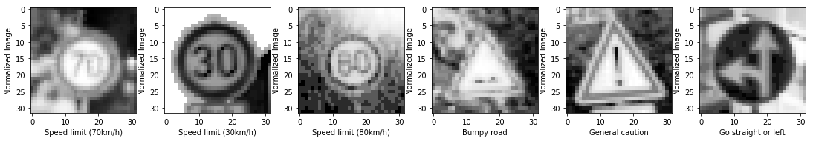


### Construct pre-processing pipeline


```python
def preprocess(X_data):
    """
    Sequentially apply previously crafted pre-processing functions over the input data.
    """
    # Grayscale
    grayscale_imgs = list(map(get_grayscale, X_data))
    # Histogram equalization
    equalized_imgs = list(map(equalize_hist, grayscale_imgs))
    # Normalization
    normalized_imgs = list(map(normalize_img, equalized_imgs))
    # Convert to np array and reshape to 4 dimensions
    normalized_imgs = np.asarray(normalized_imgs)
    normalized_imgs = normalized_imgs.reshape(-1, 32, 32, 1)
    # Return pre-processed input data
    return normalized_imgs
```


```python
def augment_train_data(X_data, Y_data):
    """
    (Similar pipeline to preprocessing) Sequentially apply previously crafted pre-processing functions over the input data.
    """
    # Grayscale
    grayscale_imgs = list(map(get_grayscale, X_data))
    # Histogram equalization
    equalized_imgs = list(map(equalize_hist, grayscale_imgs))
    # Augment
    aug_all_x, aug_all_y = augment_data(equalized_imgs, Y_data)
    # Normalization
    normalized_imgs = list(map(normalize_img, aug_all_x))
    # Convert to np array and reshape to 4 dimensions
    normalized_imgs = np.asarray(normalized_imgs)
    normalized_imgs = normalized_imgs.reshape(-1, 32, 32, 1)
    # Return pre-processed input data
    return normalized_imgs, aug_all_y
```

#### Apply augmentation on training data


```python
aug_X_train, aug_y_train = augment_train_data(X_train, y_train)
```

#### Save/Pickel the training data


```python
with open('augmented_data/X_train.pkl', 'wb') as f:
    pickle.dump(aug_X_train, f)
```


```python
with open('augmented_data/y_train.pkl', 'wb') as f:
    pickle.dump(aug_y_train, f)
```

#### Load the pickled training data


```python
with open('augmented_data/X_train.pkl', mode='rb') as f:
    aug_X_train = pickle.load(f)
```


```python
with open('augmented_data/y_train.pkl', mode='rb') as f:
    aug_y_train = pickle.load(f)
```


```python
aug_X_train.shape
```


    (313191, 32, 32, 1)


```python
plt.figure(figsize=(3, 3))
plt.imshow(aug_X_train[80900].reshape(32, 32),cmap='gray')
```


    <matplotlib.image.AxesImage at 0x237c0c65898>


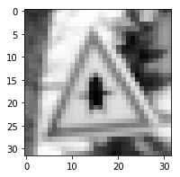


#### Shuffle training data


```python
aug_X_train, aug_y_train = shuffle(aug_X_train, aug_y_train)
```


```python
aug_X_train.shape
```


    (313191, 32, 32, 1)


### Question 2:2. Describe what your final model architecture looks like including model type, layers, layer sizes, connectivity, etc.) Consider including a diagram and/or table describing the final model.

#### Answer:

### Model Architecture

The final goal here is to build a model that can cross/reach an accuracy of over 97% on the validation set. We will be using a streamed down version of <b>VGG model</b> architecture here in order to reduce number of parameters and computation, the exact architecture is defined below.

This ConvNet follows these steps:

Input => Convolution => ReLU => Convolution => ReLU => Pooling => Convolution => ReLU => Convolution => ReLU => Pooling => Convolution => ReLU => Convolution => ReLU => Pooling => FullyConnected => ReLU => FullyConnected => ReLU => FullyConnected


```python
%%html
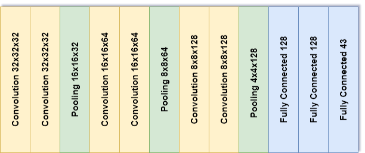
```


#### Summary of VGG Net
The VGG network architecture was introduced by Simonyan and Zisserman in their 2014 paper, Very Deep Convolutional Networks for Large Scale Image Recognition.

This network is characterized by its simplicity, using only 3×3 convolutional layers stacked on top of each other in increasing depth. Reducing volume size is handled by max pooling. Two fully-connected layers, each with 4,096 nodes are then followed by a softmax classifier (above).
In 2014, 16 and 19 layer networks were considered very deep (although we now have the ResNet architecture which can be successfully trained at depths of 50-200 for ImageNet and over 1,000 for CIFAR-10).


```python
class VGGnet:
    def __init__(self, n_out=43, mu=0, sigma=0.1, learning_rate=0.001):
        # Hyperparameters
        self.mu = mu
        self.sigma = sigma

        # Layer 1 (Convolutional): Input = 32x32x1. Output = 32x32x32.
        self.conv1_W = tf.Variable(tf.truncated_normal(shape=(3, 3, 1, 32), mean = self.mu, stddev = self.sigma))
        self.conv1_b = tf.Variable(tf.zeros(32))
        self.conv1 = tf.nn.conv2d(x, self.conv1_W, strides=[1, 1, 1, 1], padding='SAME') + self.conv1_b
        
        # ReLu Activation.
        self.conv1 = tf.nn.relu(self.conv1)

        # Layer 2 (Convolutional): Input = 32x32x32. Output = 32x32x32.
        self.conv2_W = tf.Variable(tf.truncated_normal(shape=(3, 3, 32, 32), mean = self.mu, stddev = self.sigma))
        self.conv2_b = tf.Variable(tf.zeros(32))
        self.conv2 = tf.nn.conv2d(self.conv1, self.conv2_W, strides=[1, 1, 1, 1], padding='SAME') + self.conv2_b
        
        # ReLu Activation.
        self.conv2 = tf.nn.relu(self.conv2)
        
        # Layer 3 (Pooling): Input = 32x32x32. Output = 16x16x32.
        self.conv2 = tf.nn.max_pool(self.conv2, ksize=[1, 2, 2, 1], strides=[1, 2, 2, 1], padding='VALID')
        self.conv2 = tf.nn.dropout(self.conv2, keep_prob_conv)

        # Layer 4 (Convolutional): Input = 16x16x32. Output = 16x16x64.
        self.conv3_W = tf.Variable(tf.truncated_normal(shape=(3, 3, 32, 64), mean = self.mu, stddev = self.sigma))
        self.conv3_b = tf.Variable(tf.zeros(64))
        self.conv3 = tf.nn.conv2d(self.conv2, self.conv3_W, strides=[1, 1, 1, 1], padding='SAME') + self.conv3_b
        
        # ReLu Activation.
        self.conv3 = tf.nn.relu(self.conv3)

        # Layer 5 (Convolutional): Input = 16x16x64. Output = 16x16x64.
        self.conv4_W = tf.Variable(tf.truncated_normal(shape=(3, 3, 64, 64), mean = self.mu, stddev = self.sigma))
        self.conv4_b = tf.Variable(tf.zeros(64))
        self.conv4 = tf.nn.conv2d(self.conv3, self.conv4_W, strides=[1, 1, 1, 1], padding='SAME') + self.conv4_b
        
        # ReLu Activation.
        self.conv4 = tf.nn.relu(self.conv4)
        
        # Layer 6 (Pooling): Input = 16x16x64. Output = 8x8x64.
        self.conv4 = tf.nn.max_pool(self.conv4, ksize=[1, 2, 2, 1], strides=[1, 2, 2, 1], padding='VALID')
        self.conv4 = tf.nn.dropout(self.conv4, keep_prob_conv) # dropout

        # Layer 7 (Convolutional): Input = 8x8x64. Output = 8x8x128.
        self.conv5_W = tf.Variable(tf.truncated_normal(shape=(3, 3, 64, 128), mean = self.mu, stddev = self.sigma))
        self.conv5_b = tf.Variable(tf.zeros(128))
        self.conv5 = tf.nn.conv2d(self.conv4, self.conv5_W, strides=[1, 1, 1, 1], padding='SAME') + self.conv5_b
        
        # ReLu Activation.
        self.conv5 = tf.nn.relu(self.conv5)

        # Layer 8 (Convolutional): Input = 8x8x128. Output = 8x8x128.
        self.conv6_W = tf.Variable(tf.truncated_normal(shape=(3, 3, 128, 128), mean = self.mu, stddev = self.sigma))
        self.conv6_b = tf.Variable(tf.zeros(128))
        self.conv6 = tf.nn.conv2d(self.conv5, self.conv6_W, strides=[1, 1, 1, 1], padding='SAME') + self.conv6_b
        
        # ReLu Activation.
        self.conv6 = tf.nn.relu(self.conv6)
        
        # Layer 9 (Pooling): Input = 8x8x128. Output = 4x4x128.
        self.conv6 = tf.nn.max_pool(self.conv6, ksize=[1, 2, 2, 1], strides=[1, 2, 2, 1], padding='VALID')
        self.conv6 = tf.nn.dropout(self.conv6, keep_prob_conv) # dropout

        # Flatten. Input = 4x4x128. Output = 2048.
        self.fc0 = flatten(self.conv6)

        # Layer 10 (Fully Connected): Input = 2048. Output = 128.
        self.fc1_W = tf.Variable(tf.truncated_normal(shape=(2048, 128), mean = self.mu, stddev = self.sigma))
        self.fc1_b = tf.Variable(tf.zeros(128))
        self.fc1 = tf.matmul(self.fc0, self.fc1_W) + self.fc1_b

        # ReLu Activation.
        self.fc1 = tf.nn.relu(self.fc1)
        self.fc1 = tf.nn.dropout(self.fc1, keep_prob) # dropout

        # Layer 11 (Fully Connected): Input = 128. Output = 128.
        self.fc2_W = tf.Variable(tf.truncated_normal(shape=(128, 128), mean = self.mu, stddev = self.sigma))
        self.fc2_b = tf.Variable(tf.zeros(128))
        self.fc2 = tf.matmul(self.fc1, self.fc2_W) + self.fc2_b

        # ReLu Activation.
        self.fc2 = tf.nn.relu(self.fc2)
        self.fc2 = tf.nn.dropout(self.fc2, keep_prob) # dropout

        # Layer 12 (Fully Connected): Input = 128. Output = n_out(43)
        self.fc3_W = tf.Variable(tf.truncated_normal(shape=(128, n_out), mean = self.mu, stddev = self.sigma))
        self.fc3_b = tf.Variable(tf.zeros(n_out))
        self.logits = tf.matmul(self.fc2, self.fc3_W) + self.fc3_b

        # Training operation
        self.one_hot_y = tf.one_hot(y, n_out)
        self.cross_entropy = tf.nn.softmax_cross_entropy_with_logits_v2(logits=self.logits, labels=self.one_hot_y)
        self.loss_operation = tf.reduce_mean(self.cross_entropy)
        self.optimizer = tf.train.AdamOptimizer(learning_rate = learning_rate)
        self.training_operation = self.optimizer.minimize(self.loss_operation)

        # Accuracy operation
        self.correct_prediction = tf.equal(tf.argmax(self.logits, 1), tf.argmax(self.one_hot_y, 1))
        self.accuracy_operation = tf.reduce_mean(tf.cast(self.correct_prediction, tf.float32))

        # Saving all variables
        self.saver = tf.train.Saver()
        
    def y_predict(self, X_data, BATCH_SIZE=64):
        num_examples = len(X_data)
        y_pred = np.zeros(num_examples, dtype=np.int32)
        sess = tf.get_default_session()
        for offset in range(0, num_examples, BATCH_SIZE):
            batch_x = X_data[offset:offset+BATCH_SIZE]
            y_pred[offset:offset+BATCH_SIZE] = sess.run(tf.argmax(self.logits, 1), 
                               feed_dict={x:batch_x, keep_prob:1, keep_prob_conv:1})
        return y_pred
    
    def evaluate(self, X_data, y_data, BATCH_SIZE=64):
        num_examples = len(X_data)
        total_accuracy = 0
        sess = tf.get_default_session()
        for offset in range(0, num_examples, BATCH_SIZE):
            batch_x, batch_y = X_data[offset:offset+BATCH_SIZE], y_data[offset:offset+BATCH_SIZE]
            accuracy = sess.run(self.accuracy_operation, 
                                feed_dict={x: batch_x, y: batch_y, keep_prob: 1.0, keep_prob_conv: 1.0 })
            total_accuracy += (accuracy * len(batch_x))
        return total_accuracy / num_examples
```


```python
x = tf.placeholder(tf.float32, (None, 32, 32, 1))
y = tf.placeholder(tf.int32, (None))
```


```python
keep_prob = tf.placeholder(tf.float32) # For fully-connected layers
keep_prob_conv = tf.placeholder(tf.float32) # For convolutional layers
```


```python
EPOCHS = 10
BATCH_SIZE = 150 # Tested: BATCH_SIZE = 65 to be more accurate(but a bit slow for training)
DIR = 'Saved_Models'
```


```python
aug_X_train[0].shape
```


    (32, 32, 1)


### Question 2:3. Describe how you trained your model. The discussion can include the type of optimizer, the batch size, number of epochs and any hyperparameters such as learning rate.

#### Answer:

### Train, Validate and Test the Model

A validation set can be used to assess how well the model is performing. A low accuracy on the training and validation
sets imply underfitting. A high accuracy on the training set but low accuracy on the validation set implies overfitting.

<b>We will train our network in the following way:</b>
- Before each epoch, we'll shuffle the training set.
- Train the model on training data set in batches which are preprocessed, augmented and normalized.
- We will be using dropout with hyperparameters for dropout rates as keep_prob and keep_prob_conv for layers in our neural network.
Deep Neural networks are likely to quickly overfit a training dataset with few examples. This has the effect of the model learning the statistical noise in the training data, which results in poor performance when the model is evaluated on new data, e.g. a test dataset. Generalization error increases due to overfitting. Dropout is a regularization method that approximates training a large number of neural networks with different architectures in parallel. During training, some number of layer outputs are randomly ignored or “dropped out.” This has the effect of making the layer look-like and be treated-like a layer with a different number of nodes and connectivity to the prior layer. Dropout has the effect of making the training process noisy, forcing nodes within a layer to probabilistically take on more or less responsibility for the inputs.
- We specify the learning rate of 0.001, it helps us control on how much we are letting the model adjust the weights of network with respect the loss gradient.
- We minimize the loss function using the Adaptive Moment Estimation (Adam) Algorithm, it is an extension to stochastic gradient descent. However it is different to classical stochastic gradient descent. It is designed to combine the advantages of two other extensions of stochastic gradient descent which are Adaptive Gradient Algorithm (AdaGrad) and Root Mean Square Propagation (RMSProp). This algorithm calculates an exponential moving average of the gradient and the squared gradient, and the parameters beta1 and beta2 control the decay rates of these moving averages.
- Calculate softmax cross entropy between predictions and labels.
- Evaluate the error.
- We run minimize() function on the optimizer which use backprobagation to update the network and minimize our training loss.
- After each epoch, we measure the loss and accuracy of the validation set.
- A low accuracy on the training and validation sets imply underfitting. A high accuracy on the training set but low accuracy on the validation set implies overfitting.
- We save the model with final learned parameters.


#### Run our constructed tensorflow graph inside session passing batches to the above crafted graph


```python
VGGNet_Model = VGGnet(n_out = n_classes)
model_name = "VGGNet"

# Validation set preprocessing
X_valid_preprocessed = preprocess(X_valid)
one_hot_y_valid = tf.one_hot(y_valid, 43)

with tf.Session() as sess:
    sess.run(tf.global_variables_initializer())
    num_examples = len(aug_y_train)
    print("Training...")
    print()
    for i in range(EPOCHS):
        aug_X_train, aug_y_train = shuffle(aug_X_train, aug_y_train)
        for offset in range(0, num_examples, BATCH_SIZE):
            end = offset + BATCH_SIZE
            batch_x, batch_y = aug_X_train[offset:end], aug_y_train[offset:end]
            sess.run(VGGNet_Model.training_operation, 
            feed_dict={x: batch_x, y: batch_y, keep_prob : 0.5, keep_prob_conv: 0.7})

        validation_accuracy = VGGNet_Model.evaluate(X_valid_preprocessed, y_valid)
        print("EPOCH {} : Validation Accuracy = {:.3f}%".format(i+1, (validation_accuracy*100)))
    VGGNet_Model.saver.save(sess, os.path.join(DIR, model_name))
    print("Model saved")
```

    Training...
    
    EPOCH 1 : Validation Accuracy = 96.440%
    EPOCH 2 : Validation Accuracy = 98.277%
    EPOCH 3 : Validation Accuracy = 98.753%
    EPOCH 4 : Validation Accuracy = 99.342%
    EPOCH 5 : Validation Accuracy = 99.252%
    EPOCH 6 : Validation Accuracy = 99.320%
    EPOCH 7 : Validation Accuracy = 99.433%
    EPOCH 8 : Validation Accuracy = 99.478%
    EPOCH 9 : Validation Accuracy = 99.478%
    EPOCH 10 : Validation Accuracy = 99.342%
    Model saved
    

We received a validation accuracy of +95% right from the first epoch while the model starts saturating from 5th epoch, these are great metrics to obtain. The augmented data paved a way for our model to have larger dataset to train with.

#### Testing on test data


```python
X_test_preprocessed = preprocess(X_test)
```


```python
with tf.Session() as sess:
    VGGNet_Model.saver.restore(sess, os.path.join(DIR, "VGGNet"))
    y_test_pred = VGGNet_Model.y_predict(X_test_preprocessed)
    test_accuracy = sum(y_test == y_test_pred)/len(y_test)
    print("Test Accuracy = {:.1f}%".format(test_accuracy*100))
```

    INFO:tensorflow:Restoring parameters from Saved_Models\VGGNet
    Test Accuracy = 98.0%
    

#### Confusion matrix

By inspecting the confusion matrix it is clear to us where the model is failing.

Most prominent and noticable failure occures when the model is trying to predict <b>speed limit</b> traffic sign


```python
c_matrix = confusion_matrix(y_test, y_test_pred)
c_matrix = c_matrix.astype('float') / c_matrix.sum(axis=1)[:, np.newaxis]
c_matrix = np.log(.0001 + c_matrix)
plt.imshow(c_matrix, interpolation='nearest', cmap=plt.cm.Reds)
plt.ylabel('Actual label')
plt.xlabel('Predicted label')
plt.show()
```


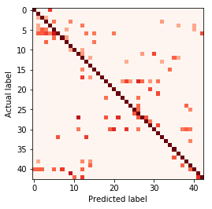


### Question 2:4. Describe the approach taken for finding a solution and getting the validation set accuracy to be at least 0.93. Include in the discussion the results on the training, validation and test sets and where in the code these were calculated. Your approach may have been an iterative process, in which case, outline the steps you took to get to the final solution and why you chose those steps. Perhaps your solution involved an already well known implementation or architecture. In this case, discuss why you think the architecture is suitable for the current problem.

#### Answer: 
### Answer at bottom in 'Conclusion Section' (Placed at the bottom since this wasn't a proper place to keep that answer.

---

## Step 3: Test a Model on New Images

To give yourself more insight into how your model is working, download at least five pictures of German traffic signs from the web and use your model to predict the traffic sign type.

You may find `signnames.csv` useful as it contains mappings from the class id (integer) to the actual sign name.

### Question 3:1. Choose five German traffic signs found on the web and provide them in the report. For each image, discuss what quality or qualities might be difficult to classify.

#### Answer:

### Load and Output the Images


```python
import glob
new_imgs_container = []
new_img_names = glob.glob('test_new_images/' + "*.png")
for new_img_name in new_img_names:
    new_img = cv2.imread(new_img_name)
    new_img = cv2.cvtColor(new_img, cv2.COLOR_BGR2RGB)
    new_imgs_container.append(new_img)
new_imgs = np.asarray(new_imgs_container)
preprocessed_new_imgs = preprocess(new_imgs)
```


```python
plt.figure(figsize=(15, 16))
for i in range(len(new_imgs_container)):
    plt.subplot(2, 5, i+1)
    plt.imshow(new_imgs_container[i])
    label_str = new_img_names[i].split('\\')[-1].split('.')[0]
    plt.xlabel(signs[int(label_str)])
plt.show()
```


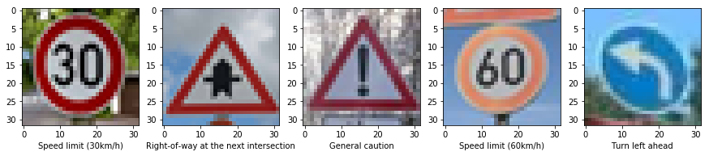


The images we downloaded contain both hard and easy to predict images, harder ones are those which is not easy to distinguish/containing similar features with respect to few other classes while easier ones are those which have some unique structural difference between the sign formation and other features.

Here from the selected/downloaded images harder ones can be considered as the speed limit traffic signs, whereas the easier ones are turn left and right of way intersection traffic signs.

In our case the model trained so well it is clearly able to perdict all the downloaded images. 

### Question 3:2. Discuss the model's predictions on these new traffic signs and compare the results to predicting on the test set. At a minimum, discuss what the predictions were, the accuracy on these new predictions, and compare the accuracy to the accuracy on the test set.

#### Answer:

### Predict the Sign Type for Each Image


```python
def predict_new_img(new_imgs_array, k=5):
    with tf.Session() as sess:
        VGGNet_Model.saver.restore(sess, os.path.join(DIR, "VGGNet"))
        y_prob, y_pred = sess.run(tf.nn.top_k(tf.nn.softmax(VGGNet_Model.logits), k=k), 
                             feed_dict={x:new_imgs_array, keep_prob:1, keep_prob_conv:1})
    return y_prob, y_pred

y_prob, y_pred = predict_new_img(preprocessed_new_imgs)
```

    INFO:tensorflow:Restoring parameters from Saved_Models\VGGNet
    

### Analyze Performance


```python
# Extract file name(without . extension), I have used their ground truth labels when naming.
ground_truth_labels = [int(new_img_names[i].split('\\')[-1].split('.')[0]) for i in range(len(new_img_names))] 
new_imgs_accuracy = 0
for i in range(preprocessed_new_imgs.shape[0]):
    if ground_truth_labels[i] == y_pred[i][0]:
        new_imgs_accuracy += 0.2
print("Prediction accuracy on new images = {:.1f}%".format(new_imgs_accuracy*100))
```

    Prediction accuracy on new images = 100.0%
    

The model was able to correctly guess 5 of the 5 traffic signs, which gives an accuracy of 100%. This compares favorably to the accuracy on the test set of 98.0%.

### Output Top 5 Softmax Probabilities For Each Image Found on the Web

For each of the new images, print out the model's softmax probabilities to show the **certainty** of the model's predictions (limit the output to the top 5 probabilities for each image). [`tf.nn.top_k`](https://www.tensorflow.org/versions/r0.12/api_docs/python/nn.html#top_k) could prove helpful here. 

The example below demonstrates how tf.nn.top_k can be used to find the top k predictions for each image.

`tf.nn.top_k` will return the values and indices (class ids) of the top k predictions. So if k=3, for each sign, it'll return the 3 largest probabilities (out of a possible 43) and the correspoding class ids.

Take this numpy array as an example. The values in the array represent predictions. The array contains softmax probabilities for five candidate images with six possible classes. `tf.nn.top_k` is used to choose the three classes with the highest probability:

```
# (5, 6) array
a = np.array([[ 0.24879643,  0.07032244,  0.12641572,  0.34763842,  0.07893497,
         0.12789202],
       [ 0.28086119,  0.27569815,  0.08594638,  0.0178669 ,  0.18063401,
         0.15899337],
       [ 0.26076848,  0.23664738,  0.08020603,  0.07001922,  0.1134371 ,
         0.23892179],
       [ 0.11943333,  0.29198961,  0.02605103,  0.26234032,  0.1351348 ,
         0.16505091],
       [ 0.09561176,  0.34396535,  0.0643941 ,  0.16240774,  0.24206137,
         0.09155967]])
```

Running it through `sess.run(tf.nn.top_k(tf.constant(a), k=3))` produces:

```
TopKV2(values=array([[ 0.34763842,  0.24879643,  0.12789202],
       [ 0.28086119,  0.27569815,  0.18063401],
       [ 0.26076848,  0.23892179,  0.23664738],
       [ 0.29198961,  0.26234032,  0.16505091],
       [ 0.34396535,  0.24206137,  0.16240774]]), indices=array([[3, 0, 5],
       [0, 1, 4],
       [0, 5, 1],
       [1, 3, 5],
       [1, 4, 3]], dtype=int32))
```

Looking just at the first row we get `[ 0.34763842,  0.24879643,  0.12789202]`, you can confirm these are the 3 largest probabilities in `a`. You'll also notice `[3, 0, 5]` are the corresponding indices.

### Question 3:3 Describe how certain the model is when predicting on each of the five new images by looking at the softmax probabilities for each prediction. Provide the top 5 softmax probabilities for each image along with the sign type of each probability.

#### Answer: 


```python
import pandas as pd
prediction_indices = [l[0] for l in y_pred]
predicitons_values = [signs[int(idx)] for idx in prediction_indices]
pd.set_option('max_colwidth', 1000)
pd.DataFrame(zip(y_pred, y_prob, prediction_indices, predicitons_values), columns=['Indices', 'Probabilities', 'Predicted Index', 'Predicted Value'])
```


<div>
<style scoped>
    .dataframe tbody tr th:only-of-type {
        vertical-align: middle;
    }

    .dataframe tbody tr th {
        vertical-align: top;
    }

    .dataframe thead th {
        text-align: right;
    }
</style>
<table border="1" class="dataframe">
  <thead>
    <tr style="text-align: right;">
      <th></th>
      <th>Indices</th>
      <th>Probabilities</th>
      <th>Predicted Index</th>
      <th>Predicted Value</th>
    </tr>
  </thead>
  <tbody>
    <tr>
      <th>0</th>
      <td>[1, 2, 5, 4, 0]</td>
      <td>[1.0, 3.722121e-21, 8.712576e-24, 4.5527434e-26, 5.371315e-29]</td>
      <td>1</td>
      <td>Speed limit (30km/h)</td>
    </tr>
    <tr>
      <th>1</th>
      <td>[11, 30, 27, 0, 1]</td>
      <td>[1.0, 2.3282428e-26, 1.1189527e-36, 0.0, 0.0]</td>
      <td>11</td>
      <td>Right-of-way at the next intersection</td>
    </tr>
    <tr>
      <th>2</th>
      <td>[18, 26, 28, 27, 20]</td>
      <td>[1.0, 1.8305154e-14, 1.866918e-18, 3.32546e-20, 7.2192254e-26]</td>
      <td>18</td>
      <td>General caution</td>
    </tr>
    <tr>
      <th>3</th>
      <td>[3, 5, 2, 15, 9]</td>
      <td>[1.0, 1.9240574e-11, 2.0744442e-17, 1.9943938e-26, 9.2066e-31]</td>
      <td>3</td>
      <td>Speed limit (60km/h)</td>
    </tr>
    <tr>
      <th>4</th>
      <td>[34, 38, 35, 9, 37]</td>
      <td>[1.0, 2.9233479e-18, 1.4390196e-19, 1.2648935e-25, 1.732376e-26]</td>
      <td>34</td>
      <td>Turn left ahead</td>
    </tr>
  </tbody>
</table>
</div>


```python
y_prob, y_pred
```


    (array([[1.0000000e+00, 3.7221209e-21, 8.7125758e-24, 4.5527434e-26,
             5.3713151e-29],
            [1.0000000e+00, 2.3282428e-26, 1.1189527e-36, 0.0000000e+00,
             0.0000000e+00],
            [1.0000000e+00, 1.8305154e-14, 1.8669179e-18, 3.3254599e-20,
             7.2192254e-26],
            [1.0000000e+00, 1.9240574e-11, 2.0744442e-17, 1.9943938e-26,
             9.2065996e-31],
            [1.0000000e+00, 2.9233479e-18, 1.4390196e-19, 1.2648935e-25,
             1.7323760e-26]], dtype=float32), array([[ 1,  2,  5,  4,  0],
            [11, 30, 27,  0,  1],
            [18, 26, 28, 27, 20],
            [ 3,  5,  2, 15,  9],
            [34, 38, 35,  9, 37]]))


```python
preprocessed_new_imgs[1].shape
```


    (32, 32, 1)


```python
plt.figure(figsize=(15, 16))
for i in range(len(new_imgs_container)):
    plt.subplot(5, 2, 2*i+1)
    plt.imshow(new_imgs_container[i])
    plt.title(signs[y_pred[i][0]])
    plt.axis('off')
    plt.subplot(5, 2, 2*i+2)
    plt.barh(np.arange(1, 6, 1), y_prob[i, :])
    labels = [signs[j] for j in y_pred[i]]
    plt.yticks(np.arange(1, 6, 1), labels)
plt.show()
```


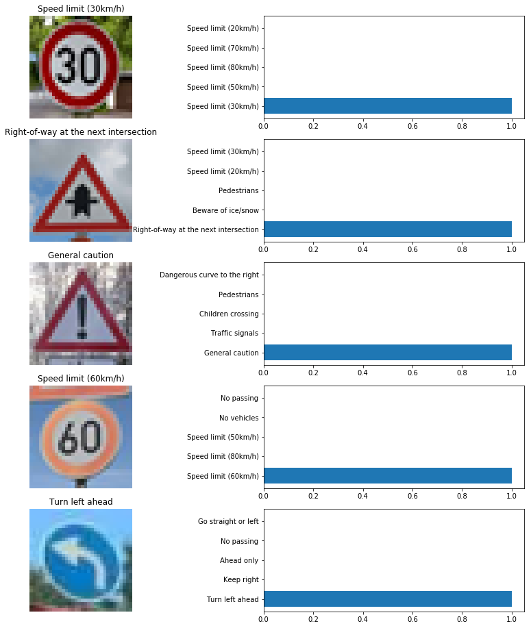


Our trained model was able to predict very confidently on all the downloaded images with a very high probabilities. The model attained an accuracy of 100% at prediction on these downloaded images. 

However if we inspect the actual probabilites in case where the ground truth is 'Speed limit(80km/h)' we do notice that model also has a relatively higher probability(not very noticeably) for 'Speed limit(80km/h)'.

### Project Writeup

Once you have completed the code implementation, document your results in a project writeup using this [template](https://github.com/udacity/CarND-Traffic-Sign-Classifier-Project/blob/master/writeup_template.md) as a guide. The writeup can be in a markdown or pdf file. 

> **Note**: Once you have completed all of the code implementations and successfully answered each question above, you may finalize your work by exporting the iPython Notebook as an HTML document. You can do this by using the menu above and navigating to  \n",
    "**File -> Download as -> HTML (.html)**. Include the finished document along with this notebook as your submission.

---

## Step 4 (Optional): Visualize the Neural Network's State with Test Images

 This Section is not required to complete but acts as an additional excersise for understaning the output of a neural network's weights. While neural networks can be a great learning device they are often referred to as a black box. We can understand what the weights of a neural network look like better by plotting their feature maps. After successfully training your neural network you can see what it's feature maps look like by plotting the output of the network's weight layers in response to a test stimuli image. From these plotted feature maps, it's possible to see what characteristics of an image the network finds interesting. For a sign, maybe the inner network feature maps react with high activation to the sign's boundary outline or to the contrast in the sign's painted symbol.

 Provided for you below is the function code that allows you to get the visualization output of any tensorflow weight layer you want. The inputs to the function should be a stimuli image, one used during training or a new one you provided, and then the tensorflow variable name that represents the layer's state during the training process, for instance if you wanted to see what the [LeNet lab's](https://classroom.udacity.com/nanodegrees/nd013/parts/fbf77062-5703-404e-b60c-95b78b2f3f9e/modules/6df7ae49-c61c-4bb2-a23e-6527e69209ec/lessons/601ae704-1035-4287-8b11-e2c2716217ad/concepts/d4aca031-508f-4e0b-b493-e7b706120f81) feature maps looked like for it's second convolutional layer you could enter conv2 as the tf_activation variable.

For an example of what feature map outputs look like, check out NVIDIA's results in their paper [End-to-End Deep Learning for Self-Driving Cars](https://devblogs.nvidia.com/parallelforall/deep-learning-self-driving-cars/) in the section Visualization of internal CNN State. NVIDIA was able to show that their network's inner weights had high activations to road boundary lines by comparing feature maps from an image with a clear path to one without. Try experimenting with a similar test to show that your trained network's weights are looking for interesting features, whether it's looking at differences in feature maps from images with or without a sign, or even what feature maps look like in a trained network vs a completely untrained one on the same sign image.

<figure>
 
 <figcaption>
 <p></p> 
 <p style="text-align: center;"> Your output should look something like this (above)</p> 
 </figcaption>
</figure>
 <p></p> 


### Question 4:1 Discuss the visual output of your trained network's feature maps. What characteristics did the neural network use to make classifications?

#### Answer:


```python
### Visualize your network's feature maps here.
### Feel free to use as many code cells as needed.

# image_input: the test image being fed into the network to produce the feature maps
# tf_activation: should be a tf variable name used during your training procedure that represents the calculated state of a specific weight layer
# activation_min/max: can be used to view the activation contrast in more detail, by default matplot sets min and max to the actual min and max values of the output
# plt_num: used to plot out multiple different weight feature map sets on the same block, just extend the plt number for each new feature map entry

def outputFeatureMap(image_input, tf_activation, activation_min=-1, activation_max=-1 ,plt_num=1):
    # Here make sure to preprocess your image_input in a way your network expects
    # with size, normalization, ect if needed
    # image_input =
    # Note: x should be the same name as your network's tensorflow data placeholder variable
    # If you get an error tf_activation is not defined it may be having trouble accessing the variable from inside a function
    activation = tf_activation.eval(session=sess,feed_dict={x : image_input})
    featuremaps = activation.shape[3]
    plt.figure(plt_num, figsize=(15,15))
    for featuremap in range(featuremaps):
        plt.subplot(6,8, featuremap+1) # sets the number of feature maps to show on each row and column
        plt.title('FeatureMap ' + str(featuremap)) # displays the feature map number
        if activation_min != -1 & activation_max != -1:
            plt.imshow(activation[0,:,:, featuremap], interpolation="nearest", vmin =activation_min, vmax=activation_max, cmap="gray")
        elif activation_max != -1:
            plt.imshow(activation[0,:,:, featuremap], interpolation="nearest", vmax=activation_max, cmap="gray")
        elif activation_min !=-1:
            plt.imshow(activation[0,:,:, featuremap], interpolation="nearest", vmin=activation_min, cmap="gray")
        else:
            plt.imshow(activation[0,:,:, featuremap], interpolation="nearest", cmap="gray")
```

#### Load test stimuli image


```python
stimuli_img = cv2.imread('test_new_images/1.png')
stimuli_img = cv2.cvtColor(stimuli_img, cv2.COLOR_BGR2RGB)
# Nest/Contain stimuli image in a container to add a 4th dimension
stimuli_array = np.asarray([stimuli_img])
# Pass stimuli image through preprocessor
preprocessed_stimuli_array = preprocess(stimuli_array)
```


```python
fig_stim, (ax1, ax2) = plt.subplots(1, 2)
ax1.imshow(stimuli_img)
ax2.imshow(preprocessed_stimuli_array[0].reshape((32,32)), cmap='gray')
```


    <matplotlib.image.AxesImage at 0x2387edb1160>


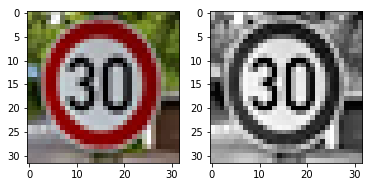


```python
# def predict_y_single_img(preprocessed_stimuli_array):
with tf.Session() as sess:
    VGGNet_Model.saver.restore(sess, os.path.join(DIR, "VGGNet"))
    conv_layer = tf.get_default_graph().get_tensor_by_name('Conv2D_1:0')
    outputFeatureMap(preprocessed_stimuli_array, conv_layer)
```

    INFO:tensorflow:Restoring parameters from Saved_Models\VGGNet
    


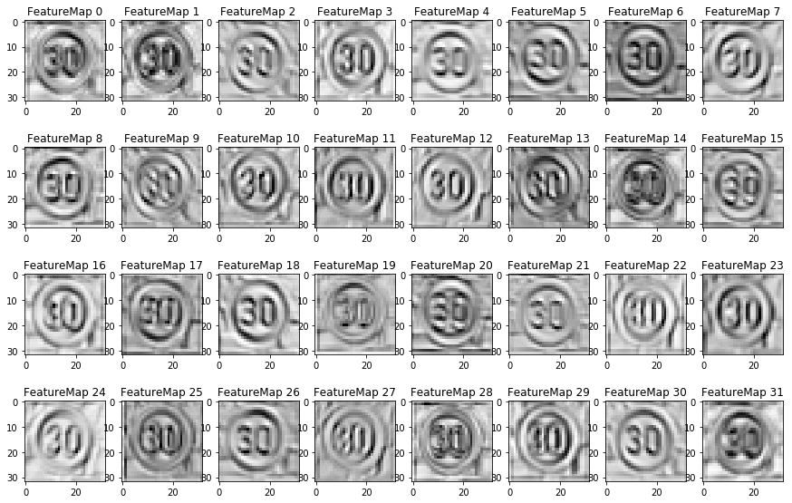


```python
# with tf.Session() as sess:
#     VGGNet_Model.saver.restore(sess, os.path.join(DIR, "VGGNet"))
#     op = sess.graph.get_operations()
#     print([m.values() for m in op])
```

### Below Answer for 'Question 2:4' as mentioned above

#### Question 2:4. Describe the approach taken for finding a solution and getting the validation set accuracy to be at least 0.93. Include in the discussion the results on the training, validation and test sets and where in the code these were calculated. Your approach may have been an iterative process, in which case, outline the steps you took to get to the final solution and why you chose those steps. Perhaps your solution involved an already well known implementation or architecture. In this case, discuss why you think the architecture is suitable for the current problem.

#### Answer:

## Conclusion
My final model results are:
* Training set accuracy of 100%
* Validation set accuracy of 99.5%
* Test set accuracy of 98%

The first architecture I tried was traditional LeNet which was taught in the lesson itself, but with LeNet after training it sufficiently enough on the training data it still couldn't generalize well to the test set. LeNet model is in itself a remarkable architecture to understand features in an image but to capture the low details in order to generalize towards even more data it isn't deep enough, so my next approach was to look for other well-known architectures that could capture the low level features essentially the ones which are deep enough yet balance the number of parameters.

VGGNet architecture as described previously was chosen in an intension to give enough room for our architecture to understand the features and have as many layers to distinguish out smaller combinations of features in the input image leading to a much better prediction.

Using VGGNet, we've been able to reach a very high accuracy rate. We can also try to explore other pre-processing techniques to further improve the model's accuracy. It is obvious for our model to not perform well on images which aren't very clear because of cases like motion blur effect or extreme over exposure which totally disrupts the features of the traffic sign which are essential to classify them in the first place. Given all that this model is fine tuned and deep enough to classify and make sense out of any images of the classes which were used for training, but would surely fail on images of any other arbitrary classes which it doesn't know.

Overall our model achieved a classification accuracy of 98% over test set, 99.5% accuracy over validation set and also the model correctly identified all new downloaded images.

Unfortunately, there are two major drawbacks with VGGNet:
* It is painfully slow to train.
* The network architecture weights themselves are quite large (in terms of disk/bandwidth).

It is proven with emergence of new architectures that the size and depth of the model doesn't always factor in to attain a higher accuracy, however inferior VGGNet is we still can use VGG(not as efficiently) in many deep learning image classification problems, however, smaller network architectures are often more desirable (such as SqueezeNet, GoogLeNet, etc.). 
